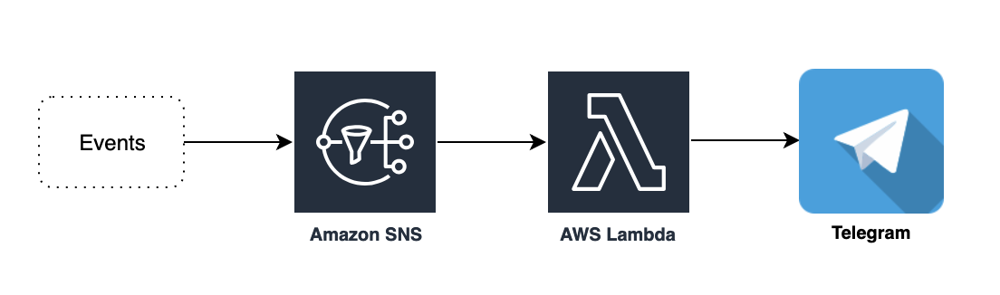

# MONITORING RESOURCES UTILIZATION
**Architecture**

We use ``AWS CloudWatch``, ``AWS SNS`` and ``Lambda Function`` to monitor and notification the **Resources Utilization** (**RU**):
1. **CloudWatch Dashboard**: help the customer can monitor the ``RU`` by the default dashboard on ``CloudWatch Dashboard``. But the customer can modify based on **requirements**.
2. **CloudWatch Alarm**: we use  ``Alarm`` feature to trigger when the ``RU`` higher than ``threshold``  
3. **AWS SNS**: We use ``AWS SNS`` for notification to **Email**. In addition, the ``AWS SNS`` will trigger the ``Lambda function`` to **custom the message** from events
4. **Lambda function**: We use ``Lambda function`` to deploy the Python for customize the message and send the message to ``SNS`` to notification via **Email**.The ``Lambda function`` also send the message by ``API`` to notification via **Telergam message**

References: [Simple SNS to Telegram notifications bot](https://bezdelev.com/hacking/aws-sns-to-telegram-bot/)
