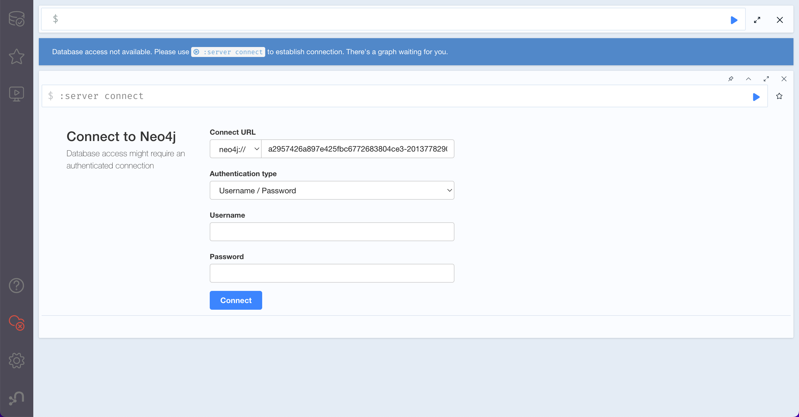

# Deploy DataHub on AWS EKS

## Introduction
DataHub is a 3rd generation data catalog that enables Data Discovery, Collaboration, Governance, and end-to-end Observability that is built for the Modern Data Stack. DataHub employs a model-first philosophy, with a focus on unlocking interoperability between disparate tools & systems.

The figures below describe the high-level architecture of DataHub.


## Quick-start

### Preperation
1. Clone the repository
```
git clone https://github.com/tutrungtranvn/datahub-on-eks.git
```
2. Move to folder
```
cd datahub-on-eks
```

### 1. Deploy AWS EKS with Terraform
* Modify the variables with exist `private subnet IDs` and `public subnet IDs` on [variable file](./variables.tf)

```
variable "private_subnets_id" {
  type    = list(string)
  default = ["subnet-111111", "subnet-222222"]
}

variable "public_subnets_id" {
  type    = list(string)
  default = ["subnet-333333", "subnet-444444"]
}
```
* Modify [main file](./main.tf) with exist `VPC ID`
```
vpc_id                   = "vpc-000000"
```

* Update Kubernetes cluster

Replace the parameters on [connect-eks-cluster](./connect-eks-cluster.sh) to update K8s cluster
```
export cluster_name="cluster-name"
export region="ap-southeast-1"
```
Run command
```
aws eks --region $region update-kubeconfig --name $cluster_name
```
### 2. Create secret on EKS cluster
Assuming kubectl context points to the correct kubernetes cluster, first create kubernetes secrets that contain `MySQL and Neo4j passwords`
```
kubectl create secret generic mysql-secrets --from-literal=mysql-root-password=datahub
kubectl create secret generic neo4j-secrets --from-literal=neo4j-password=datahubneo4j
```

Add datahub helm repo by running the following
```
helm repo add datahub https://helm.datahubproject.io/
```
### 3. Deploy Kafka on EKS 
Kafka will be deployed on EKS node, we can replace it with the managed service such as AWS MSK,..

We use `helm` to deploy `Kafka`. The config file on [here](./yaml-file/kafka-service.yaml)
```
helm upgrade --install prerequisites datahub/datahub-prerequisites --values ./yaml-file/prerequisites-service.yaml
```

### 4. Deploy DataHub and SetupJob for data source
The config file on [here](./yaml-file/datahub-values.yaml)

```
helm upgrade --install datahub datahub/datahub -f ./yaml-file/datahub-values.yaml
```


### 5. Check DataHub UI with LoadBalancer
Get the `URL LoadBalancer` and check `EXTERNAL-IP` of `svc/datahub-datahub-frontend`
```
kubectl get svc
```
Open the browser with `LoadBalancer URL`:`9002`


### 6. Check Neo4J UI for authentication (Optional)
Get the `URL LoadBalancer` and check `EXTERNAL-IP` of `svc/neo4j-lb-neo4j`
```
kubectl get svc
```
Open the browser with `Neo4J LoadBalancer URL`:`7474`

